# 🔄 ILab UNMUL - User Flow Diagram

Comprehensive user flow diagram untuk semua user roles dan system workflows dalam sistem ILab UNMUL.

## 📊 System Overview Flow

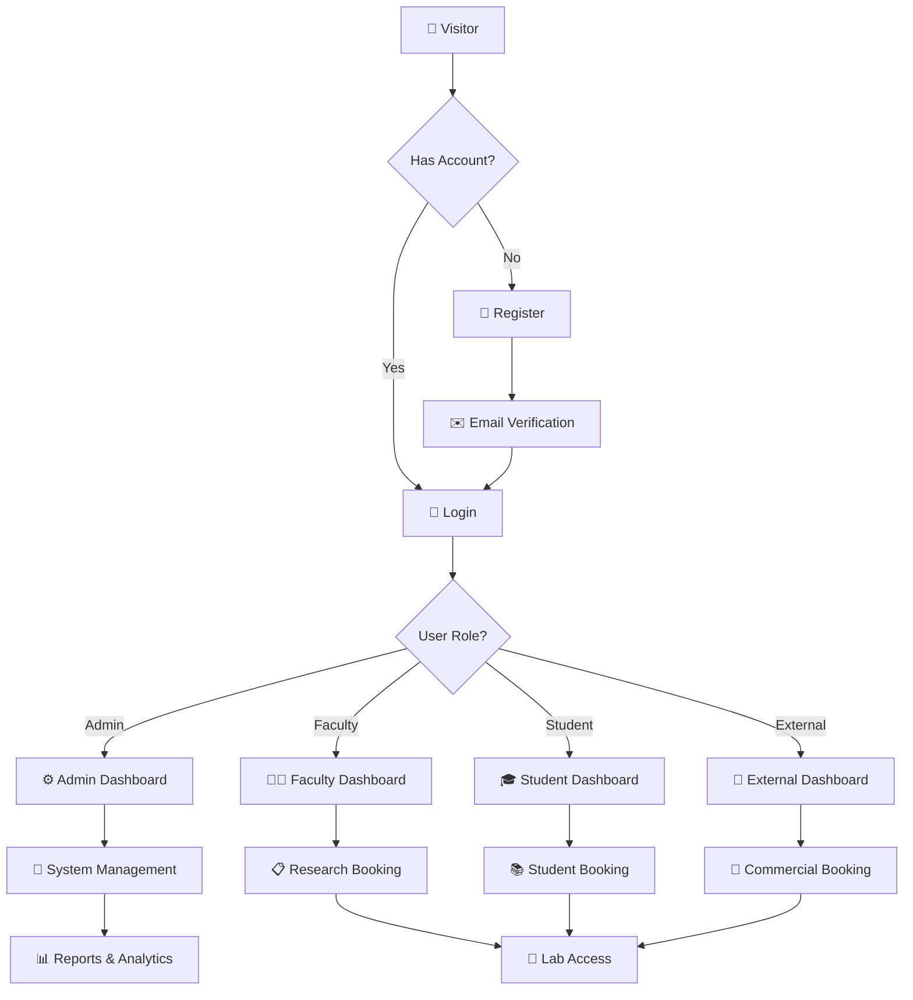

## 🎯 Detailed User Flows

### 1. 👤 Guest User Flow

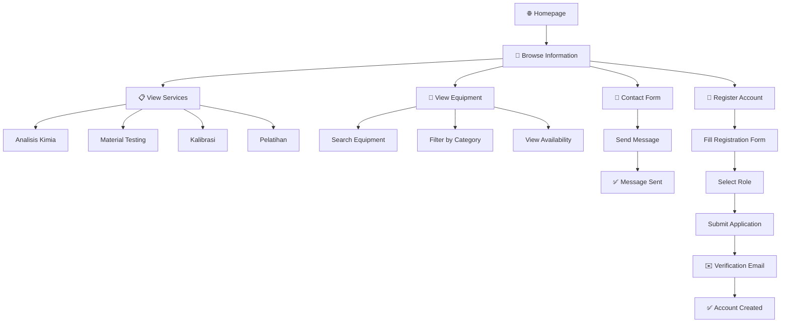

### 2. 🔑 Authentication Flow

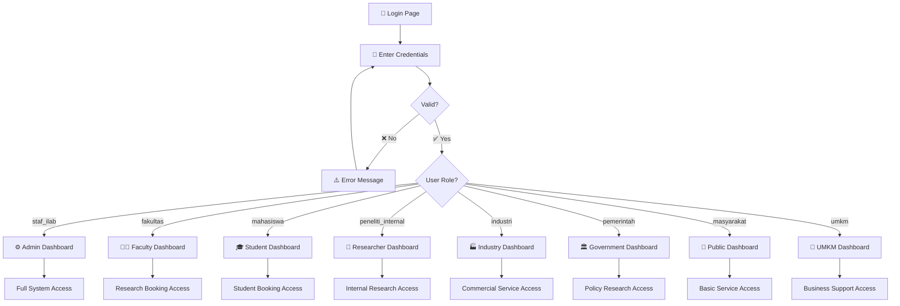

### 3. 📋 Booking System Flow

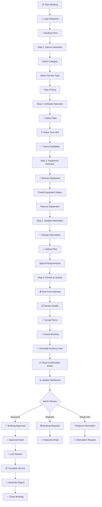

### 4. ⚙️ Admin Management Flow

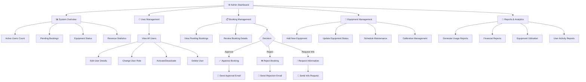

### 5. 👤 User Dashboard Flow

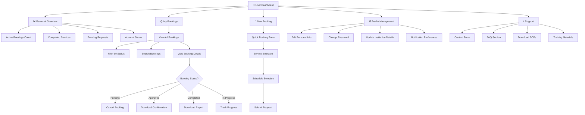

### 6. 🔬 Equipment Management Flow

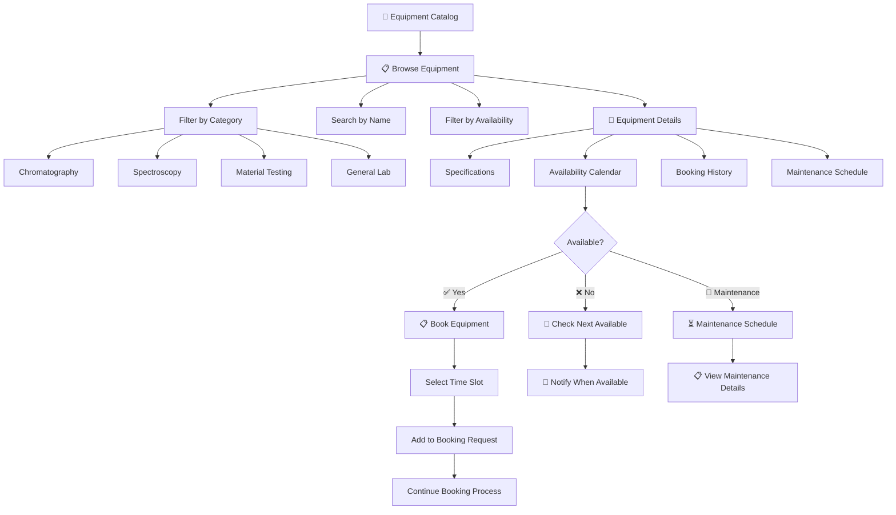

### 7. 📧 Email Notification Flow

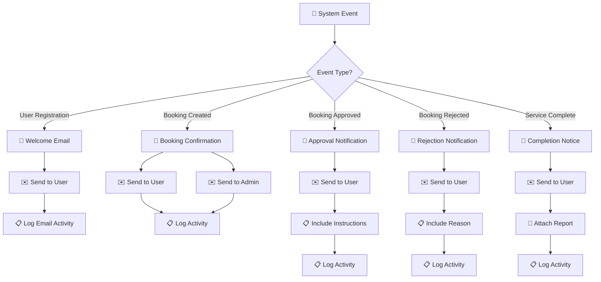

### 8. 🔒 Security & File Management Flow

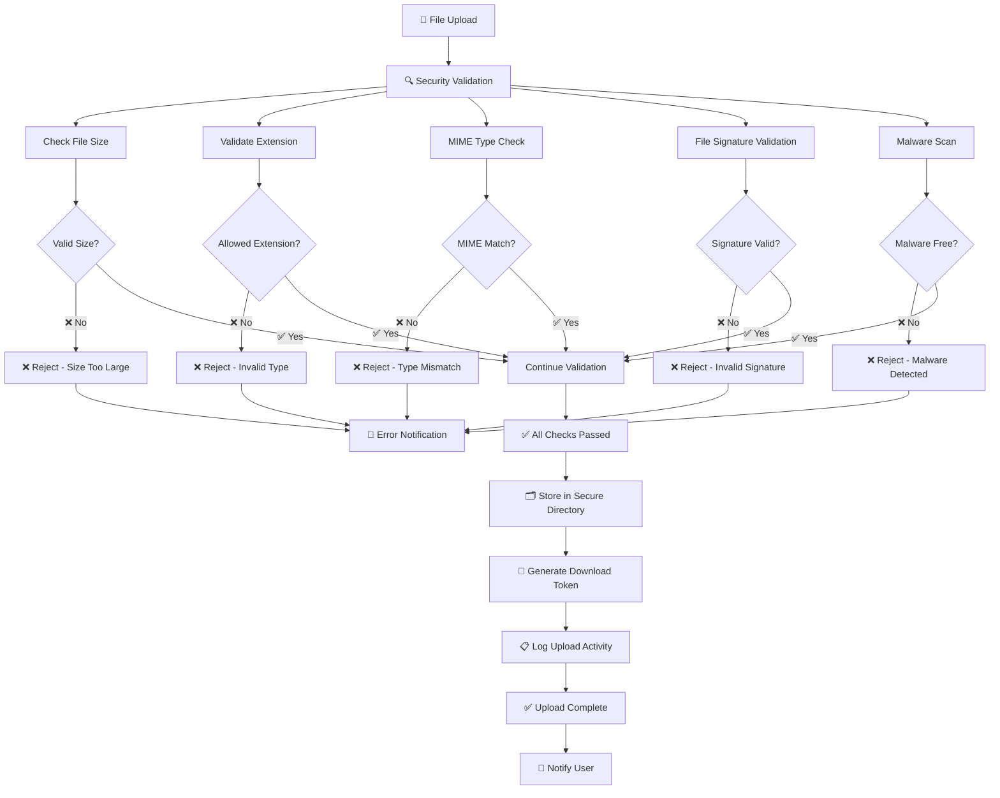

### 9. 📊 Reporting & Analytics Flow

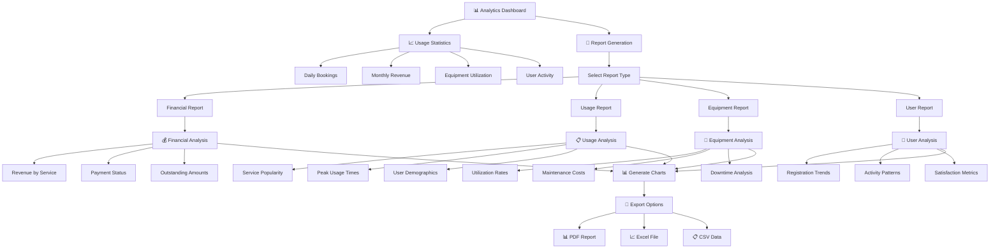

### 10. 📱 Mobile & Responsive Flow

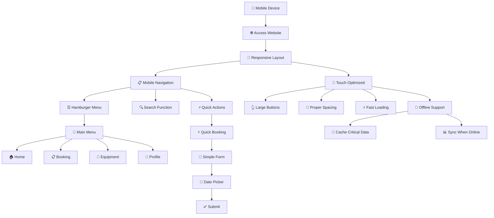

## 🎯 Key User Journeys

### Journey 1: New Student Registration → First Booking

```
👤 Student Visitor
    ↓
📝 Register Account (Role: Mahasiswa)
    ↓
✉️ Email Verification
    ↓
🔑 First Login
    ↓
🎓 Student Dashboard
    ↓
📋 Create New Booking
    ↓
🔬 Select GC-MS Analysis
    ↓
📅 Choose Available Slot
    ↓
📎 Upload Sample Files
    ↓
✅ Submit Booking Request
    ↓
📧 Confirmation Email
    ↓
⏳ Wait for Admin Approval
    ↓
✅ Booking Approved
    ↓
🔬 Attend Lab Session
    ↓
📄 Receive Analysis Report
```

### Journey 2: Industry Client Commercial Service

```
🏭 Industry Representative
    ↓
🌐 Browse Services (No Login)
    ↓
💰 Check Commercial Pricing
    ↓
📝 Register Company Account
    ↓
🔑 Login as Industry User
    ↓
📋 Submit Service Request
    ↓
📞 Admin Contact for Quote
    ↓
💰 Negotiate Service Agreement
    ↓
✅ Approve Quote & Schedule
    ↓
🔬 Service Execution
    ↓
📄 Detailed Report Delivery
    ↓
💳 Payment Processing
    ↓
📊 Ongoing Relationship
```

### Journey 3: Admin Daily Workflow

```
⚙️ Admin Login
    ↓
📊 Review Dashboard Statistics
    ↓
📋 Check Pending Bookings (5 new)
    ↓
🔍 Review First Booking Request
    ↓
✅ Approve Standard Request
    ↓
📧 System Sends Approval Email
    ↓
🔍 Review Complex Request
    ↓
📞 Contact User for Clarification
    ↓
✅ Approve After Discussion
    ↓
🔧 Check Equipment Status
    ↓
⚠️ Schedule Maintenance for AAS
    ↓
👥 Review New User Registrations
    ↓
✅ Activate Verified Users
    ↓
📊 Generate Weekly Report
    ↓
🔚 End of Day Summary
```

## 🔄 Integration Points

### External System Integration

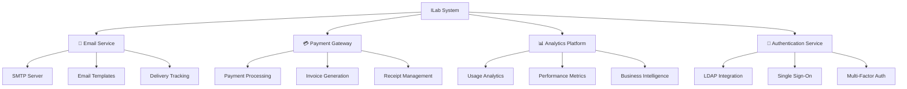

## 🎨 UI/UX Flow States

### Visual State Management

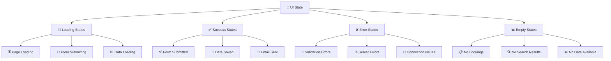

---

## 📊 Flow Metrics & KPIs

| Flow | Success Rate Target | Average Time | Drop-off Points |
|------|-------------------|--------------|-----------------|
| **User Registration** | 85%+ | 3 minutes | Email verification |
| **Booking Creation** | 90%+ | 5 minutes | File upload step |
| **Admin Approval** | 95%+ | 2 minutes | Complex requests |
| **Payment Process** | 95%+ | 3 minutes | Payment gateway |
| **Mobile Usage** | 80%+ | Same as desktop | Form complexity |

## 🎯 Optimization Opportunities

### Identified Improvement Areas

1. **📱 Mobile Booking** - Simplify multi-step form
2. **🔍 Search Experience** - Add auto-suggestions
3. **📧 Email Delivery** - Implement retry logic
4. **📊 Dashboard Loading** - Add progressive loading
5. **🔐 Security Flow** - Streamline file validation

---

**🎨 Visual Flow Diagrams Ready!** 

User flows memberikan comprehensive overview dari semua user interactions dan system processes dalam ILab UNMUL, perfect untuk development reference, user training, dan system documentation.
